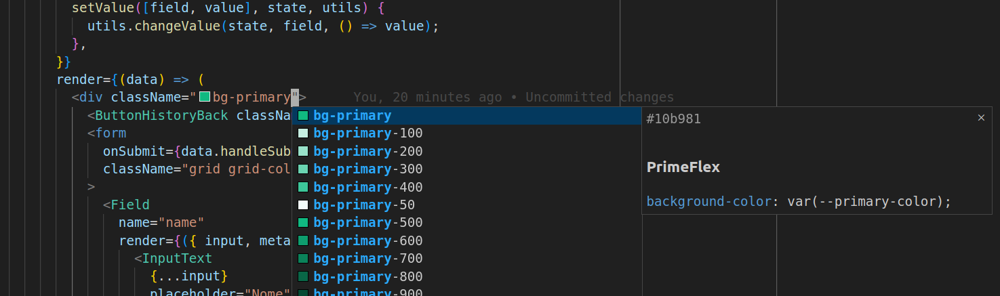

### PRIMEFLEX

### Extension Commands

#### `Primeflex: Restart Colors`
When you update the style file or for some reason you need to update the extension reference to the style sheet, run this command

### Recommended VS Code Settings

#### `primeflex.sourceTheme`
Use `primeflex.sourceTheme` to define the css file with the variables that primeflex needs to work. By default, the file pointed to will be `./src/style.css`

#### `primeflex.enabled`

Navigate between projects without getting in the way, by default we leave the extension active in all environments but you can go to the global settings and disable it and configure it in the `.vscode/settings.json` file for precise control, the same happens between folders in the workspace

#### `primeflex.classAttributes`
The HTML attributes for which to provide class completions. Default: `class`, `className`, `styleClass`, `ngClass`, `class:list`

---
ⓘ Can you help? Feel free, together we can create our own tools.